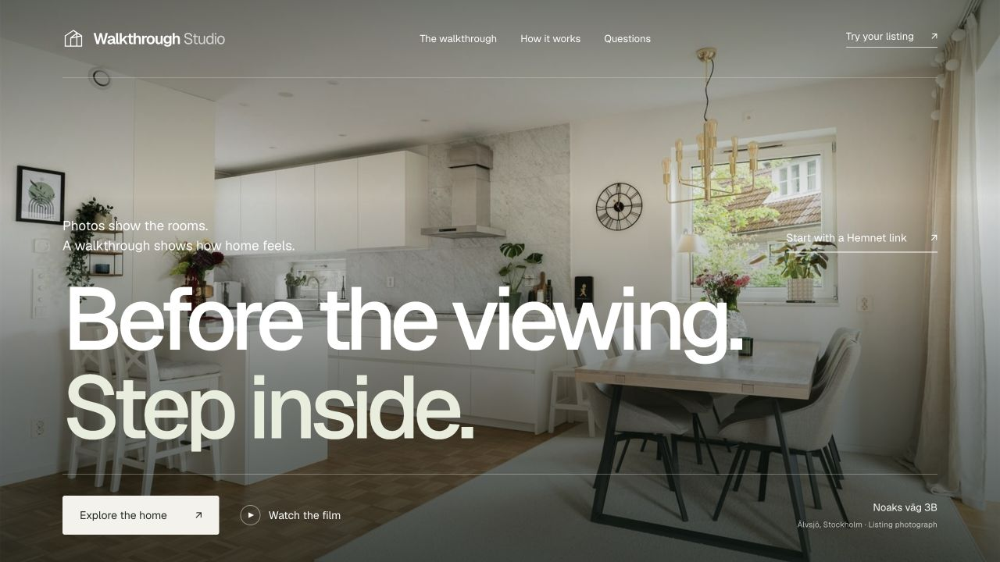

<div align="center">

# Walkthrough Studio

**A home listing. An editable scene. Two ways to explore.**

Turn Hemnet references into a reviewable 3D draft, explore it in Three.js, and continue in Unreal Engine.

[Quick start](#quick-start) · [Local Codex skill](#use-the-codex-skill) · [Engine comparison](#choose-your-output) · [Quality & limits](docs/QUALITY.md)



*The new landing page, shown with the local Noaks väg 3B example. Explore the home, watch the walkthrough, or start with your own Hemnet link.*

[](https://github.com/akkikumar72/hemnet-walkthrough-studio/actions/workflows/ci.yml)
[](LICENSE)
[](https://nodejs.org/)

</div>

## What it does

- **Bring your own property.** Import an accessible Hemnet listing or upload permitted JPEG, PNG and WebP photos. Review, categorize and select the references.
- **Create an editable draft.** Use OpenAI vision with a strict scene schema, or let Codex prepare the scene using the included local skill. Keep measurements and inferred details clearly labeled.
- **Explore room to room.** Overview shows the complete roof; Cutaway opens the interior for inspection. Walk on a floor, jump to a room, or play a continuous camera route with the matching source-photo inset. Walking and video keep the roof in place.
- **Take it further.** Export scene JSON, a binary glTF model, a 1080p browser video, or an Unreal project with a continuous sequence and 4K rendering preset.
- **Keep projects local.** Separate project folders, retained source files, versioned scene edits, and session-only or environment-based API keys.

The Lumen interface includes locally hosted fonts, keyboard-accessible tabs, full-screen viewing and a responsive project workspace. Shared geometry now includes closed roof slabs, gables, foliage, and distinct desks, swivel chairs and drawer cabinets. These improve the tools available for refinement; a listing still needs evidence review and correction.

> **Current release: reconstruction workbench, v0.1.** Automatic output uses procedural geometry and simple materials. It is a starting point for refinement, not a one-click photorealistic digital twin or a finished premium service. Hemnet can block automated imports. Local photo upload is the supported fallback. See [quality limits](docs/QUALITY.md) and [verified checks](docs/VALIDATION.md).

## Quick start

Install [Node.js 22 or later](https://nodejs.org/), then:

```sh
git clone https://github.com/akkikumar72/hemnet-walkthrough-studio.git
cd hemnet-walkthrough-studio
npm ci --ignore-scripts
npm run build
npm start
```

Open **http://127.0.0.1:8770** for the Next.js landing page. Paste a Hemnet link to continue to the studio, or open **http://127.0.0.1:8770/studio/** and select **Explore the demo**. No API key or Unreal installation is needed for the fictional demo, scene editing, or browser exports.

For development, use `npm run dev`. The original standalone studio server remains available through `npm run start:studio`.

The landing page is adapted from the visual direction of [Forma Interior](https://www.framer.com/marketplace/templates/forma-interior/). It features the existing Noaks väg 3B film and interactive tour when that private project is installed locally. Those media files are not bundled in this public repository. Set `NOAKS_HOME_DIR` if the home project is not in the adjacent `noaks-vag-home` folder, then use `npm run noaks:serve` in a second terminal to start the original interactive tour. See [landing scope, setup and verification](docs/LANDING.md).

For your property:

1. Paste a Hemnet link and confirm permission to use the photos. If import fails, choose **Upload your photos**.
2. Review the images. Mark floor plans, interiors and exteriors, exclude irrelevant images, and add any known measurements.
3. Configure an API key, confirm the selected-photo upload, and choose **Generate 3D draft**. Alternatively, use the [Codex skill](#use-the-codex-skill).
4. Review the geometry, assumptions and camera route. Refine the scene before exporting or delivering it.

Projects are saved in the ignored `workspace/` directory. Back up this directory if you move computers. See [local data and security](docs/SECURITY.md).

## API key setup

The application uses an **OpenAI platform API key**. It does not extract credentials from Codex or use a ChatGPT subscription as an API key. Codex also supports API-key authentication, but its existing login is separate from this app's requests. See [OpenAI authentication](https://developers.openai.com/codex/auth).

Choose either:

- **API settings** in the app: keep a key in memory until the page reloads. It is sent only to this local server and then OpenAI when generating.
- Copy `.env.example` to `.env` and set `OPENAI_API_KEY`. Restart the server. Never commit this file.

`OPENAI_MODEL` defaults to `gpt-6-astra` and is editable in Settings. Use an available model supporting image inputs and structured outputs. Generation sends selected photos, the listing title/description, and your notes to the [Responses API](https://developers.openai.com/api/docs/guides/images-vision). Requests are billable, use `store: false`, and require an explicit Generate action. There are no automatic paid retries. Account access, prices and data handling follow your OpenAI account settings.

**No app key?** The Codex-assisted workflow can inspect the references and write a scene using your existing Codex access. It does not require a second app API call. This still uses your configured agent service; it is not offline AI inference.

## Choose your output

| | Three.js browser | Unreal Engine |
|---|---|---|
| Start | Included viewer | Separate compatible Unreal installation |
| Shared data | Scene JSON and compiled geometry | Same scene, geometry and route |
| Preview | Orbit, same-floor walking, room navigation | Editable map and camera actors |
| Guided tour | Continuous route playback | `HomeTour` Level Sequence |
| Video | Frame-by-frame 1920×1080 WebM at 30 fps (WebCodecs) | `Render4K` preset for 3840×2160 PNG frames at 30 fps |
| Refinement | Edit JSON or extend the renderer | Replace meshes, materials, lighting and staging in the editor |
| Current limits | Procedural assets, no full stair physics | Export does not include a packaged player or automatic movie render |

For Unreal: download **Unreal project**, extract it into a new folder, open `StudioHome.uproject`, then use **Tools → Execute Python Script** to run `build_unreal.py`. It saves a new timestamped map, sequence and preset. Open the sequence to preview and use Movie Render Queue to render. Each build preserves earlier generated assets. Rounded furniture and procedural landscape geometry are shared with the browser through included OBJ meshes. Materials and lighting are tuned per engine; the exporter does not make an approximate reconstruction photorealistic.

**Browser rendering:** matched daylight direction, window area lights, per-room reflections captured from the actual model, contact occlusion and up to four MSAA samples. Video export waits for lighting and source images, renders every route frame and writes an indexed VP9 WebM. Keep the tab visible; export pauses when the browser suspends animation. Encoding speed depends on the GPU, but the output timeline does not. Requires VP9 WebCodecs support, checked before export.

**Video presentation:** browser exports open with “3D Walkthrough” and the property title, hold for half a second, then fade into the full route. The film shows the address and changing room name at the upper left, with a matching photo inset when available. The one-second opening is added to the route duration. Download the video directly for editing or music; player controls are not part of the export. A custom opening image can be configured in the private project folder as described in [the scene architecture](docs/ARCHITECTURE.md). Unreal exports provide the scene and sequence; the browser's title and photo overlays are not built into that sequence.

The engines share the scene contract; their lighting and final pixels are not identical. Compare the same evidence, route, resolution and asset quality before choosing an engine. [Architecture and schema](docs/ARCHITECTURE.md).

## Use the Codex skill

From the repository root:

```sh
npm run skill:install
```

This installs `skills/unreal-home-wizard` into `$CODEX_HOME/skills` or `~/.codex/skills`. An existing version is moved into `.backups` first. For another installation directory:

```sh
npm run skill:install -- --dest /path/to/codex/skills
```

Start a fresh Codex task in the repository and ask:

```text
$unreal-home-wizard
Build a local Three.js walkthrough from this Hemnet link: [my link].
I have permission to use the photos. Keep dimensions marked as estimates,
cover every evidenced room, and prepare the same scene for Unreal too.
```

The skill includes evidence review, platform preflight scripts, fidelity checks and local CLI instructions. It can also run a standalone Unreal workflow. It does not install a large engine, accept licenses, purchase assets or publish your property without authorization.

## Local automation

Keep the server running in a separate terminal:

```sh
node scripts/project.mjs list
node scripts/project.mjs new 'My home' --rights
node scripts/project.mjs add-photos PROJECT_ID /path/to/photos
node scripts/project.mjs put-scene PROJECT_ID /path/to/scene.json
node scripts/project.mjs export-unreal PROJECT_ID /path/to/new-export.zip
```

Use the actual project ID returned by `new` or `list`. Run `node scripts/project.mjs --help` for all commands. Set `STUDIO_URL` if using a different local port. The [scene contract](docs/ARCHITECTURE.md) and [complete demo](examples/demo-scene.json) are useful starting points for integrations.

## Development

```sh
npm run dev
npm run check
npm test
```

Checks cover syntax, UI element bindings, URL restrictions, photo workflows, model requests, key redaction, scene validation, backups, and Unreal ZIP structure. Tests use temporary folders and a mocked model. They make no paid API requests. GitHub Actions runs the same checks on Node.js 22 and 24.

Read [validation evidence](docs/VALIDATION.md) for the distinction between automated tests, real browser checks, and an actual Unreal build. Contributions should include evidence for changed user flows and keep private listing data out of fixtures.

Listing photographs and third-party assets are not covered by this repository's code license. The public demo and README image use original fictional geometry.
