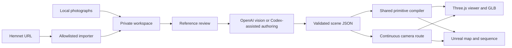

# Architecture

## Small modules, shared evidence

- `app/`: Next.js landing page, responsive navigation, preserved film/tour showcase, Hemnet intake handoff and custom 404.
- `src/site-server.js` and `src/site-handler.js`: one loopback origin for the Next.js page and existing studio at `/studio/`; allowlisted private demo media with byte-range streaming. Noaks itself remains a separate unchanged viewer. Old `/?project=` links redirect into the studio.
- `src/server.js`: loopback HTTP API, local projects, background jobs and static assets.
- `src/importer.js`: Hemnet URL normalization, gallery extraction, bounded downloads and image persistence.
- `src/analyze.js`: one explicit OpenAI Responses request with image inputs and structured output. It never executes model-generated code.
- `src/scene.js`: JSON Schema, semantic validation and route warnings.
- `public/geometry.js`: compound furniture and renderer-neutral primitives, including trees, hedges and gables.
- `public/shapes.js`: shared rounded shapes and deterministic leaf geometry.
- `src/unreal-meshes.js`: the same shapes exported as centimetre-scale OBJ meshes for Unreal.
- `public/lighting.js`: matched daylight, window lights and per-room environment captures. Captures approximate local illumination and reflections; they are not occlusion-correct global illumination.
- `public/video.js`: deterministic 30 fps WebCodecs encoding and a seekable single-track VP9 WebM container.
- `public/viewer.js`: WebGL preview, movement, route playback, GLB and video recording. Video composition uses locally hosted Roboto for an upper-left address and changing room name, with a compact unlabelled photo inset at the lower right. Font loading completes before frame encoding. Exports prepend a centered address title on `#007e47`: a 0.5-second hold and 0.5-second fade over the stationary first view, followed by the complete route. The exported duration is one second longer than the scene route. A private project may set `videoBackground: true` and supply `video-background.jpg`; the local API serves that fixed project asset, and export decodes it before compositing a centered cover crop behind the title. Projects without an image retain the solid green opening.
- `src/unreal.js` and `scripts/build_unreal.py`: self-contained editable Unreal export.
- `scripts/project.mjs`: the same local API for Codex or terminal use.

## Scene version 1

The executable schema in `src/scene.js` is authoritative. The demo is a complete example. Coordinates are metres, Y up, X/Z on the floor plane. An element's position is its center; its size is its full bounding box. Rotation is degrees around Y.

The `roof` primitive is a closed inclined slab: its full bounding box is `size`, vertical thickness is `min(0.08, height)` metres, and it rises along local +X. A 180-degree yaw reverses the slope. The `wedge` primitive is a solid triangular prism rising along +X for gable wall infill. Both export through the same triangle geometry to Unreal and GLB. Home roof components use `roof-` IDs and ceilings use `ceiling-` IDs. Overview displays the complete shell; Cutaway hides these components explicitly. Walking, route playback, video and environment captures always restore them.

Rooms contain IDs, names, floor indices, elevations, rectangular bounds and photo IDs. Elements reference rooms and source photos and mark confidence as `observed` or `estimated`. Arbitrary materials, scripts and remote asset URLs are not accepted. Compound geometry uses procedural furnishings and metre-scale material detail.

Furniture uses explicit semantic kinds: `vanity-desk`, `writing-desk`, `office-chair`, `task-chair`, and `drawer-chest` distinguish shallow drawer desks, open frame desks, perforated swivel chairs, solid upholstered swivel chairs and drawer storage across both engines. Width is local X, depth is local Z, and the desk/chest front or seated chair direction is local +Z before yaw. The shared perforated chair back contains real mesh holes. Task chairs instead use rounded solid cushions with fabric material; both caster bases include per-part yaw and meet the floor. Photo-based generation instructions require object counts, orientation and clearance to be reviewed together.

Mirror-face IDs use reflective materials and botanical bedding IDs use parallel procedural patterns in the browser and Unreal material builder. They approximate the observed appearance; neither captured-room mirror reflections nor the generated fabric pattern claim exact photographic fidelity.

Route points specify room, camera position, target, and duration. The first point holds; subsequent points ease between the previous and current positions and targets. Both engines use the same interpolation. Unreal bakes the route at 30 fps and converts metres/Y-up into centimetres/Z-up. Browser camera FOV is vertical 68 degrees and the Unreal tour camera uses the corresponding 16:9 filmback.

Validation checks shapes, limits, IDs, references and nonzero camera targets. Review adds warnings for missing room coverage, fast travel, vertical transitions and sampled wall intersections. It does not infer photographic truth or certify navigation. Warnings require human review.

## Limits and extension points

Projects accept up to 150 JPEG/PNG/WebP references, each under 15 MB. A model request accepts up to 80 selected references and a bounded byte total. These limits keep local workloads finite, not guarantee provider acceptance.

Hemnet layout changes can break parsing; keep parser fixtures synthetic. The current importer reads accessible HTML, not a licensed Hemnet API. It refuses redirects and access restrictions rather than silently following unknown destinations.

Production refinement can add licensed detailed assets, UV materials, calibrated lighting, better navigation and measured geometry. Such work needs an extension to the scene format and both exporters, or editor-side Unreal refinement. Current GLB exports contain geometry and material data, not a standalone web app or source photographs.

Browser exports use exact frame timestamps, bounded encoder backpressure and explicit source-photo decoding before a room transition is encoded. Cancellation disposes the encoder and restores the preview. No paid API, cloud upload or screen capture is involved. Room reflection captures rebuild when the scene changes; static sun shadows rebuild when roof visibility changes. Window area-light fills do not cast occlusion shadows, and environment probes are room approximations, so Lumen equivalence is not claimed.
