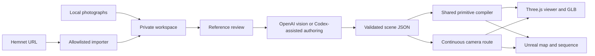

# Architecture

## Small modules, shared evidence

- `src/server.js`: loopback HTTP API, local projects, background jobs and static assets.
- `src/importer.js`: Hemnet URL normalization, gallery extraction, bounded downloads and image persistence.
- `src/analyze.js`: one explicit OpenAI Responses request with image inputs and structured output. It never executes model-generated code.
- `src/scene.js`: JSON Schema, semantic validation and route warnings.
- `public/geometry.js`: compound furniture and renderer-neutral primitives.
- `public/viewer.js`: WebGL preview, movement, route playback, GLB and video recording.
- `src/unreal.js` and `scripts/build_unreal.py`: self-contained editable Unreal export.
- `scripts/project.mjs`: the same local API for Codex or terminal use.

## Scene version 1

The executable schema in `src/scene.js` is authoritative. The demo is a complete example. Coordinates are metres, Y up, X/Z on the floor plane. An element's position is its center; its size is its full bounding box. Rotation is degrees around Y.

Rooms contain IDs, names, floor indices, elevations, rectangular bounds and photo IDs. Elements reference rooms and source photos and mark confidence as `observed` or `estimated`. Arbitrary materials, scripts and remote asset URLs are not accepted. Compound geometry uses simple furnishings with flat colors.

Route points specify room, camera position, target, and duration. The first point holds; subsequent points ease between the previous and current positions and targets. Both engines use the same interpolation. Unreal bakes the route at 30 fps and converts metres/Y-up into centimetres/Z-up. Browser camera FOV is vertical 48 degrees and the Unreal tour camera uses the corresponding 16:9 filmback.

Validation checks shapes, limits, IDs, references and nonzero camera targets. Review adds warnings for missing room coverage, fast travel, vertical transitions and sampled wall intersections. It does not infer photographic truth or certify navigation. Warnings require human review.

## Limits and extension points

Projects accept up to 150 JPEG/PNG/WebP references, each under 15 MB. A model request accepts up to 80 selected references and a bounded byte total. These limits keep local workloads finite, not guarantee provider acceptance.

Hemnet layout changes can break parsing; keep parser fixtures synthetic. The current importer reads accessible HTML, not a licensed Hemnet API. It refuses redirects and access restrictions rather than silently following unknown destinations.

Production refinement can add licensed detailed assets, UV materials, calibrated lighting, better navigation and measured geometry. Such work needs an extension to the scene format and both exporters, or editor-side Unreal refinement. Current GLB exports contain geometry and material data, not a standalone web app or source photographs.
