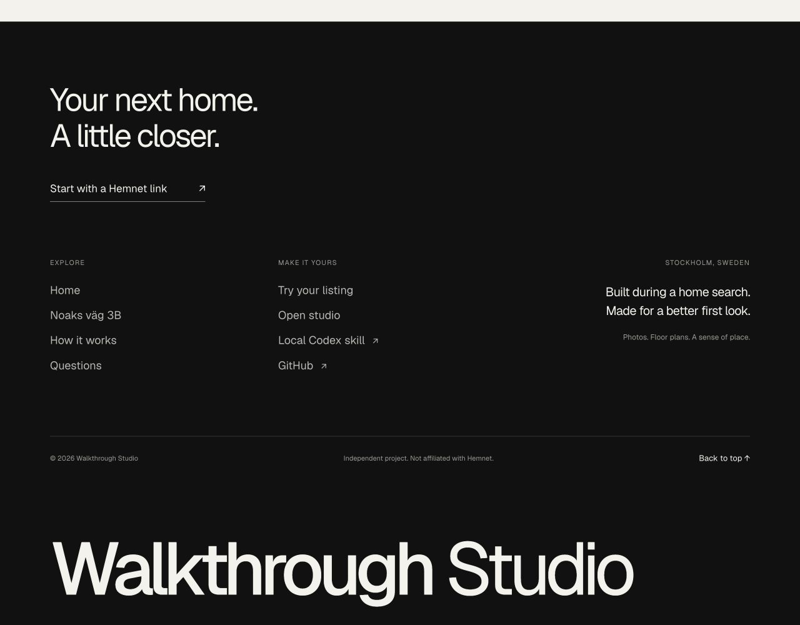

# Landing page rebuild

## Contract and reference

Reference: [Forma Interior by Hari Om](https://www.framer.com/marketplace/templates/forma-interior/), [published preview](https://formastudio.framer.ai/). Reviewed on 29 September 2026. Also considered Aerra (photography portfolio) and Cohesion (animated portfolio). Forma's full-bleed interior hero, oversized type, restrained navigation, editorial project presentation and numbered process are the closest fit.

Scope is the requested **landing page**, adapted to Walkthrough Studio in Next.js and TypeScript. This is an adaptation, not an exact template clone or a downloadable Framer project export. The existing studio, Noaks camera route, scene, video, photography and controls remain intact. No Framer runtime, template stock photography, made-up testimonials or client statistics are bundled. Existing local fonts and the real project supply the assets.

The template is listed as free under Framer's Limited Commercial License. Reference credit is retained here; the original template is not republished as an Apache-licensed template asset. [License terms](https://www.framer.com/legal/community-terms), section 7.3.1.

## Route manifest, frozen before implementation

Sitemap and robots.txt corroborate the public navigation. No private project tree was available.

| Reference path | Family | Disposition |
| --- | --- | --- |
| `/` | Landing | Adapt to `/` |
| `/about` | Studio profile | Excluded: landing-only scope |
| `/contact` | Contact | Replace homepage CTA with Hemnet intake |
| `/projects/project` | Project index | Excluded: one existing demo is featured inline |
| `/projects/core-apartment`, `/projects/horizon-villa`, `/projects/linear-workspace`, `/projects/studio-minimal`, `/projects/concrete-house`, `/projects/axis-office`, `/projects/urban-residence` | CMS details | Excluded: template properties are unrelated to the user's project |
| `/legals/terms-conditions`, `/legals/privay-policy` | Legal | Excluded: do not import another business's policies |
| Guaranteed missing path | Branded 404 | Implement a custom fallback with return-home action |
| Existing local studio | Application | Preserve at `/studio/`, including legacy `/?project=` links |

## Capability profile and intentional changes

| Section | Observed reference | Adaptation and checks |
| --- | --- | --- |
| Header / hero | Transparent nav over a full-bleed interior; 80px desktop / 16px phone gutters; very large bottom-aligned wordmark; Mona Sans; mobile menu | Original Noaks photo, product headline and two demo actions; locally hosted Geist; accessible mobile menu; check crop, contrast, keyboard, 1280×720, 810×1080, 390×844 |
| Introduction | Pale background, asymmetric label / statement, animated counters | Explain room connections with verified demo counts, no counters or invented client metrics |
| Selected work | Large project photography and varied grid | Existing film and click-to-load unchanged tour; check playback, seeking, tab switching, load errors, fullscreen and keyboard exploration |
| Services / process | Dark service section; numbered steps; intersection reveals | Three functional steps and a Hemnet form; supported reduced motion; verify validation, permission state, import handoff and upload fallback |
| Testimonials | Stateful slider | Omitted: no customer claims available |
| FAQ | Expandable questions | Original product-specific answers; keyboard-accessible native disclosure states |
| Footer | Dark expansive layout, large type, newsletter and social/contact links | Near-black footer, Hemnet call to action, product/resource columns and oversized Walkthrough Studio wordmark. No Made in Framer badge, fake contact details or inactive subscription form. Template reference credit stays in this document. |

Original text, different page height, different assets, omitted portfolio routes, static truthful figures and replacement forms are intentional. Exact pixel parity is not a goal for this requested redesign. Reference and local captures, plus the acceptance ledger, are retained in `.local/landing-review/`.

## Local showcase media

The original Noaks footage and listing photographs are **not copied into Git**. Set `NOAKS_HOME_DIR` to the existing `noaks-vag-home` directory (the sibling folder is detected locally). The server exposes only named showcase photos and the existing film, with byte-range support for seeking. The original interactive tour runs separately on its existing loopback address, configurable with `NOAKS_TOUR_URL`. Its files and rendering are unchanged.

A fresh checkout without that private media still offers the fictional studio demo and Hemnet intake, with an explicit unavailable state for the Noaks showcase. Hosting the private media publicly requires a separately configured media host and appropriate publication rights. This change does not deploy anything.

The poster is an actual frame extracted from the unchanged film, saved outside Git. To recreate it with an installed FFmpeg:

```sh
mkdir -p .local
ffmpeg -ss 48 -i "${NOAKS_HOME_DIR:-../noaks-vag-home}/Results/Video/NoaksVag_Exterior14_4K60.mp4" -frames:v 1 -q:v 2 -y .local/noaks-poster.jpg
```

## Acceptance ledger

Verified locally on 29 September 2026 using the production build:

- `npm run build`, `npm run typecheck`, `npm run check`, `npm run format:check` and `git diff --check` pass. All 16 tests pass. The integration tests require loopback networking and were run outside the restricted sandbox.
- The original film plays in the browser with a decoded size of 3840×2160 and duration 188.567 seconds. Media tests verify unchanged response bytes, partial-range seeking, suffix ranges, HEAD requests and invalid-range rejection.
- The original Three.js embed loads at Maximum quality. Selecting Kitchen changes the room from Hall to living space. Switching to the tour removes the playing video. Fullscreen includes a visible exit control; exiting returns to the landing page.
- An unsupported URL shows an inline error. The Bromsvägen Hemnet URL opens `/studio/?listing=…` with the full URL prefilled. Photo rights and AI consent remain unchecked. No import or paid generation was triggered by this verification.
- Desktop, tablet (810×1080) and phone (390×844) layouts were inspected. No horizontal overflow or broken images was found. Mobile navigation opens, closes with Escape and closes after selecting a destination. FAQ disclosures work with the keyboard. Reduced-motion emulation produces `scroll-behavior: auto`.
- All landing anchor targets resolve. The custom missing-page screen returns home. Existing project bookmarks redirect to the preserved studio. Browser console inspection found no errors or warnings.

The source and adapted page intentionally differ in copy, assets and content length. IAB zoom and screenshot stitching produced inconsistent full-page captures, so section captures are the visual evidence; no numerical pixel-parity claim is made. The local files under `.local/landing-review/` are review artifacts, not public repository assets.

No public deployment was performed. A hosted version still needs permitted showcase media and a hosted interactive tour URL; localhost media addresses are only appropriate for the local preview.

Footer follow-up: the dark footer was checked at desktop and 390px phone widths. Navigation targets resolve, the listing action scrolls to the intake form, and the large wordmark has no horizontal overflow. Production build and TypeScript checks pass. There is no Made in Framer badge or template-maker credit in the rendered footer.



Review landmarks: the Hemnet action opens the intake section; product and resource links occupy separate columns; the large wordmark returns to the top. This screenshot contains no private property photography.
